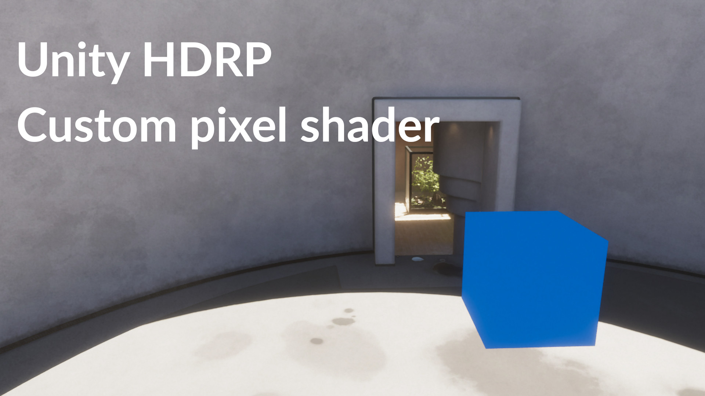

# Description

You will find inside __Assets/Ressources/Materials__ the shader files needed for the tutorial

- __SolidColor__ is a simple vertex and pixel shader which output a single color for each fragment
- __GeometryShader__ is a simple geometry shader which will make the underlying geometry grow over time, also apply a smooth gradient based on 2 input properties inside the editor.
- __SolidWithShadow__ same as SolidColor but add an extra include file at the end which will allows the mesh to cast a shadow on the scene, the codes came from a default ShaderGraph file, see in Shader graph's editor *"View Generated Shader"*

